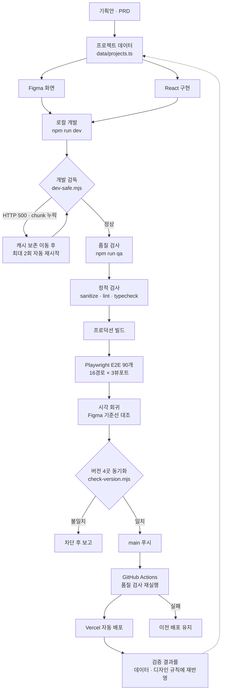

# AXION — AI 서비스 기획 · UX/UI 디자인 · 개발 포트폴리오

[](https://github.com/rlatjdgh9612/axion-portfolio/actions/workflows/quality.yml)


(https://github.com/rlatjdgh9612/axion-portfolio/actions/workflows/ga4-readme-report.yml)

> 서비스 기획부터 UX/UI 디자인, AI 기반 제품 개발까지 하나의 흐름으로 연결한 기획자 & 프로덕트 디자이너 포트폴리오 웹사이트 입니다. 금융, 핀테크, 블록체인, 세무·회계, M&A, 안전 인프라, 브랜딩 분야에서 수행한 **9개 프로젝트**를 문제 정의부터 결과까지 한자리에 정리했습니다.

---

## 바로가기

| 항목 | 링크 |
| --- | --- |
| 웹사이트 | **[axion-portfolio-one.vercel.app](https://axion-portfolio-one.vercel.app/?utm_source=github&utm_medium=referral&utm_campaign=axion_portfolio)** |
| Figma 디자인 | [AXION 프로젝트 원본](https://www.figma.com/design/cF038LTfcgHGdUTvFp67li/AXION_%ED%94%84%EB%A1%9C%EC%A0%9D%ED%8A%B8?node-id=822-11419&t=qMNXXc6BR0xSKcdG-1) |
| 기획 문서 | [프로덕트 분석](./docs/01-product-analysis.md) · [기획안](./docs/02-project-plan.md) · [PRD](./docs/03-project-prd.md) |
| 데이터 측정 | [GA4 측정·성과 자동화 가이드](./docs/06-ga4-measurement.md) |

---

## 프로젝트 결과문서

- **채용담당자** — [포트폴리오 PDF](./portfolio/AXION_Portfolio.pdf) → 아래 [핵심 역량](#핵심-역량) → [프로젝트 구성](#프로젝트-구성)
- **PM · 기획자** — [프로덕트 분석](./docs/01-product-analysis.md) → [기획안](./docs/02-project-plan.md) → [PRD](./docs/03-project-prd.md)
- **디자이너** — [Figma 원본](https://www.figma.com/design/cF038LTfcgHGdUTvFp67li/AXION_%ED%94%84%EB%A1%9C%EC%A0%9D%ED%8A%B8?node-id=822-11419&t=qMNXXc6BR0xSKcdG-1) → 아래 [디자인 시스템](#디자인-시스템)
- **개발자** — [코드 리뷰](./docs/05-code-review.md) → [QA 자동화](./docs/04-qa-automation.md) → 아래 [기술 스택](#기술-스택)
- **성과·데이터 검토** — 아래 [사용자 행동 측정 및 성과](#사용자-행동-측정-및-성과) → [GA4 측정 가이드](./docs/06-ga4-measurement.md)

---

## 프로젝트 개요

| 항목 | 내용 |
| --- | --- |
| 유형 | 개인 프로젝트 / AI·AX / UX/UI 디자인 / Web |
| 기간 | 2026.07 ~ 2026.08 (완료) |
| 담당 범위 | 서비스 기획 · UX/UI 디자인 전 과정, AI 에이전트 기반 프론트엔드 개발 |
| 진행 형태 | 기획 · 디자인 · 개발을 모두 수행하는 1인 프로젝트 |
| 사용 도구 | Figma, Figma MCP, Codex, Claude, Notion/Markdown(md), Google Analytics 4, Google Analytics Data API, Git, GitHub Actions |
| 타깃 독자 | 채용담당자, 현직 PM, Product Designer, UX/UI Designer |

AXION은 그동안 수행한 고객사 프로젝트의 문제 해결 과정과 결과물을 효과적으로 전달하기 위해 직접 기획·디자인·개발한 포트폴리오 웹사이트입니다.

---

## 핵심 역량

- 서비스 분석, 문제 정의, 목표 및 검증 기준 수립
- PRD, IA, 사용자 흐름과 요구사항 구조화
- 데스크톱 · 모바일 반응형 UX/UI 디자인
- 디자인 시스템, 디자인 토큰과 재사용 컴포넌트 설계
- Figma · Confluence · Slack 기반 PM · 개발 협업
- AI 에이전트를 활용한 기획 · 디자인 · 개발 · QA 자동화

---

### 구현 범위

- 홈 · 소개 · 프로젝트(전체 / 인턴 / 외주 / 회사 / 개인) 페이지
- 9개 프로젝트 카드 및 상세 페이지
- 데스크톱 · 모바일 반응형 레이아웃
- Light / Dark Theme 전환
- 프로젝트 필터, 내비게이션, 이력서 다운로드 및 연락 CTA
- Figma 원본 기반 카드 이미지와 공통 디자인 토큰

### 사이트 구조

| 1 Depth | 2 Depth | 주요 콘텐츠 |
| --- | --- | --- |
| 홈 | 상단 소개 | 핵심 포지셔닝, 대표 프로젝트 CTA, About 이동 |
| 홈 | 프로젝트 | 대표 프로젝트 카드, 카테고리 태그, 상세 링크 |
| 홈 | 소개 미리보기 | Product Designer 소개, 핵심 역량, About 이동 |
| 홈 | 협업 및 연락 | 협업 경험, 채용·협업 CTA, 외부 채널 연결 |
| 소개 | 상세 소개 | 경력, 역할, 전문 분야, 업무 방식과 사용 도구 |
| 프로젝트 | 전체 목록 | 필터, 프로젝트 카드 그리드 |
| 프로젝트 | 카테고리 필터 | 인턴 · 외주 · 회사 · 개인 분류 |
| 프로젝트 상세 | 개요 및 프로세스 | 기획 배경, 핵심 목표, Workflow, AI Agent, IA |
| 프로젝트 상세 | 디자인 및 결과 | 주요 화면, 디자인 시스템, 구축 결과와 학습 |
| 공통 | 내비게이션 · 푸터 | 로고, Home·About·Projects, 테마 전환, 사이트 정보 |

---

## 반응형 콘텐츠 전략

화면 크기만 바꾸는 반응형이 아니라, 검토 상황에 맞춰 **콘텐츠 깊이까지 조정하는 반응형**을 지향합니다.

| 구분 | 기준 | 콘텐츠 구성 | 전달 목표 |
| --- | --- | --- | --- |
| Mobile | 390px / Viewport `< 1024px` | 기획 배경·문제 정의 → 주요 결과물 → 축약형 디자인 시스템 | 개선 결과와 핵심 역량을 빠르게 전달 |
| Desktop | 1200px / Viewport `≥ 1024px` | 문제 정의 → 기획 방향 → IA → 주요 화면 → 개선 비교 → 디자인 시스템 | 판단 근거와 해결 과정을 충분히 전달 |

채용담당자의 빠른 탐색과 실무진의 깊은 검토를 같은 페이지에서 지원하는 것이 목표입니다. Light / Dark Theme은 모바일 · 데스크톱 모두 제공합니다.

---

## AI 기반 제품 구축 흐름

기획부터 설계 · 개발 · QA · 피드백까지 하나의 실행 흐름으로 연결하고, 각 단계에 역할이 분리된 AI 도구를 배치했습니다.

| 단계 | 수행 내용 | 도구 |
| --- | --- | --- |
| **Define** | 사용자·시장·문제 정의, 핵심 목표와 범위 설정, 검증 기준 수립 | Claude |
| **Plan** | IA · 사용자 흐름 구조화, 요구사항 · 예외 · 우선순위 정의 | Claude, Notion |
| **Structure** | 기획 · 화면 · 토큰 연결, 공통 데이터 구조화, 재사용 규칙 정의 | Markdown, Notion |
| **Design / Build** | 디자인과 구현 병렬 진행, 토큰 · 컴포넌트 연동, 반응형 구현 | Figma, Figma MCP, Codex |
| **Validate** | 디자인 정합성 · 접근성 · 기능 · 반응형 QA, 사용자 행동 측정 | Playwright, Google Analytics 4, GitHub Actions |

검증 결과는 다시 프로젝트 데이터와 디자인 규칙에 반영되어, 반복 가능한 제작 환경(AI Harness)을 구성합니다.



### 자동화 구성 요소

| 계층 | 구현 | 역할 |
| --- | --- | --- |
| 개발 감독 | `scripts/dev-safe.mjs` | 주요 경로를 순환 확인하고 런타임 이상 감지 시 캐시 보존 후 최대 2회 자동 재시작 |
| 복구 | `scripts/recover-dev.mjs` | 락 파일 기준 안전 복구 요청 |
| 아티팩트 정리 | `scripts/sanitize-next-artifacts.mjs` | 동기화로 생긴 중복 생성 파일만 선별 제거 |
| 기능 검증 | `tests/e2e/smoke.spec.ts` | 16경로 × 3뷰포트 런타임 오류 · 실패 요청 · 테마 전환 검사 |
| 시각 회귀 | `tests/visual/figma-baselines/` | Figma 원본을 기준선으로 상세 화면 대조 |
| 정합성 차단 | `scripts/check-version.mjs` | 버전 4곳 불일치 시 배포 차단 |
| 원격 동기화 | `scripts/check-git-sync.mjs` | 로컬 · 원격 상태 확인 |
| CI | `.github/workflows/quality.yml` | 푸시마다 전체 검사 재실행 |
| 성과 리포트 | `.github/workflows/ga4-readme-report.yml` | GA Data API의 최근 30일 익명 집계값을 매월 README에 자동 반영 |

자동 수정은 **최대 2회**까지만 시도합니다. 해결되지 않으면 우회하지 않고 원인 · 영향 범위 · 실패한 검사 · 다음 조치를 보고하도록 `AGENTS.md`에 규정했습니다.

---

## 디자인 시스템

프로젝트별 고유 자산을 유지하면서, 포트폴리오 인터페이스는 하나의 토큰과 공통 컴포넌트로 연결합니다.

**기반 요소**

- **Color** — 프로젝트 고유 색상과 포트폴리오 의미 기반 색상을 분리
- **Typography** — Pretendard 기반 콘텐츠 역할별 위계
- **Dimensions** — 4px 기반 Spacing, Radius, Elevation
- **Responsive** — 모바일 · 데스크톱의 레이아웃과 콘텐츠 깊이 기준

**공통 컴포넌트** — Actions · Navigation · Project Cards · Content Sections · Page Patterns · Light / Dark Theme Patterns

**운영 가이드** — 코드 토큰 기반 구현, 모바일·데스크톱 콘텐츠 우선순위 관리, 공통 컴포넌트 재사용 규칙, UI 정합성 검증 기준

---

## 기술 스택

| 영역 | 사용 기술 |
| --- | --- |
| 프레임워크 | Next.js 15 (App Router), React 19 |
| 언어 | TypeScript 5.9 |
| 스타일 | Tailwind CSS 3.4 (base) + CSS 커스텀 프로퍼티 기반 디자인 토큰 |
| 테스트 | Playwright (E2E 90개) |
| CI | GitHub Actions — Quality Gate |
| 분석 | Google Analytics 4, Google Analytics Data API, UTM 캠페인 |
| 배포 | Vercel |

```bash
npm install
npm run dev     # http://127.0.0.1:3002
npm run qa      # ESLint → TypeScript → 프로덕션 빌드 → Playwright 90개
```

---

## 사용자 행동 측정 및 성과

GA4를 통해 포트폴리오 방문 경로와 채용 관련 핵심 행동을 측정합니다. GitHub README의 배포 링크에는 `utm_source=github`를 적용해 GitHub 유입을 구분하며, 개인 식별 정보는 이벤트나 저장소에 기록하지 않습니다.

| 측정 이벤트 | 의미 | 활용 |
| --- | --- | --- |
| `project_card_click` | 프로젝트 카드 선택 | 관심 프로젝트·카테고리 파악 |
| `project_filter_select` | 프로젝트 분류 탭 선택 | 탐색 방식 파악 |
| `project_cta_click` | 프로젝트 보기 CTA 선택 | 주요 CTA 전환 확인 |
| `resume_download` | 이력서 다운로드 선택 | 채용 관심 신호 확인 |
| `contact_click` | 이메일·전화 연락 선택 | 문의 전환 확인 |
| `theme_change` | Light / Dark 전환 | 테마 사용성 참고 |

아래 표는 GitHub Actions가 GA Data API에서 가져온 **최근 30일 익명 집계값**으로 매월 1일 오전 9시(KST)에 갱신합니다. 실시간 원본 데이터와 세부 분석은 GA4에서만 확인합니다.

<!-- GA4_METRICS_START -->
> 자동 갱신 준비 완료 · GitHub Secrets 연결 후 첫 리포트가 표시됩니다.

| 활성 사용자 | 세션 | 페이지 조회 | GitHub 유입 세션 |
| ---: | ---: | ---: | ---: |
| — | — | — | — |

| 프로젝트 카드 클릭 | 이력서 다운로드 | 연락 클릭 | 세션 대비 연락 전환율 |
| ---: | ---: | ---: | ---: |
| — | — | — | — |

<sub>GA4의 익명 집계값만 표시하며 개인 식별 정보는 수집하거나 저장소에 기록하지 않습니다.</sub>
<!-- GA4_METRICS_END -->

측정 기준, 이벤트 매개변수와 GitHub 자동 갱신 설정은 [GA4 측정·성과 자동화 가이드](./docs/06-ga4-measurement.md)에 정리했습니다.

---

## 품질 기준

디자인과 구현 결과가 동일한 기준을 유지하도록 반응형 · 접근성 · 기능 · UI 정합성을 검증합니다.

- Figma 디자인 시스템과 코드 토큰의 일관성
- 데스크톱 · 모바일 반응형 콘텐츠 전략 준수
- Light / Dark Theme 시각적 일관성
- 키보드 탐색, 명도 대비, 시맨틱 마크업 등 접근성 점검
- 16개 경로 × 3개 뷰포트(1440 / 768 / 390) 런타임 오류 · 실패 요청 검사
- 모든 변경 작업의 `npm run qa` 통과 및 GitHub Actions Quality Gate 확인

자세한 내용은 [QA · 오류 수정 자동화 문서](./docs/04-qa-automation.md)를 참고하세요.

---

## 코드 리뷰

`v0.10.0` 시점의 코드를 미사용 코드와 CSS 구조 중심으로 점검했습니다. **기능 결함은 발견되지 않았으며, 지적 사항은 모두 유지보수성에 관한 것입니다.**

| 구분 | 결과 |
| --- | --- |
| 점검 항목 | 6건 (`P1` 1 · `P2` 3 · `Nit` 2) |
| 조치 완료 | 3건 — 미사용 컴포넌트 · 도달 불가 코드 · 미사용 타입 필드 제거 |
| 부분 완료 | 1건 — 죽은 CSS 규칙 113개 제거, 약 248개 잔여 |
| 계획 중 | 1건 (`P1`) — `:has()` → `data-page` 전환, 47개 규칙 |
| 보류 | 1건 (`Nit`) — CSS 파일 분리 |

**[코드리뷰 안내사항]**

`P1` 항목을 뒤로 배치한 것은 의도적으로 수행하였으며, 죽은 CSS를 먼저 제거하면 전환 대상이 52개에서 47개로 줄고, 삭제될 규칙을 잘못 건드릴 위험도 사라지기 때문입니다. 심각도와 처리 순서를 분리해 판단했습니다.

잔여 CSS 248개를 일괄 삭제하지 않은 이유도 다음과 같습니다. 자동 집계상 미사용으로 잡히지만, 검증 과정에서 메뉴 오버레이와 404 페이지처럼 **런타임에만 DOM에 나타나는 클래스**가 포함된 것을 확인했습니다. `purgecss` 등 safelist를 지원하는 도구로 처리하는 편이 안전하다고 판단한 이후에 수행하였습니다.

심각도 기준과 항목별 상세 근거는 [코드 리뷰 문서](./docs/05-code-review.md)에 정리했습니다.

---

## 버전

기획 · 디자인 · 개발 진행 단계를 버전 단위로 기록합니다.

**현재 버전: `v1.1.0` — GA4 성과 측정·README 자동 리포트 버전**

| 버전 | 반영일 | 단계 | 주요 범위 |
| --- | --- | --- | --- |
| `v1.1.0` | 2026-08-10 | 성과 측정 자동화 | GA4 사용자 행동 이벤트·GitHub UTM 측정 문서화, GA Data API 기반 최근 30일 성과 지표의 README 월간 자동 갱신 구성 |
| `v1.0.0` | 2026-08-09 | 제출 버전 | Vercel 배포·HTTPS 적용, 콘텐츠 검수, 문서·버전 동기화, 배포 명령 표준화, 상세 페이지 이미지 비율·접근성 보완 및 전체 QA |
| `v0.11.1` | 2026-08-06 | 모바일 레이아웃 보정 | 390px 기준 전면 재조정. 홈 하단 키워드 2×2 배치와 고객사 로고 2열 카드 전환, 프로젝트 더 보기 버튼 하단 이동, 홈·소개·프로젝트 세 페이지 히어로 여백과 버튼 간격 통일, 연락 섹션 문구·크기 정리, 푸터 로고 확대 및 좌측 정렬(모바일·데스크톱), 소개 페이지 제목 굵기 복원·프로필 이미지 위치 이동·업무 프로세스 간격 축소·목록 불릿 복원. 프로젝트 분류 탭 전환 시 스크롤 위치 유지, 연락 섹션 제목 2줄 조정, 헤더·푸터 로고 좌측 정렬. Vercel 배포와 함께 OG · Twitter 카드 메타데이터와 파비콘 추가. 품질 검사 워크플로 단계명 한글화 |
| `v0.11.0` | 2026-08-05 | 미사용 코드 · CSS 정리 | Figma 프레임 이미지 전환 이후 남은 구 구현과 대상이 사라진 CSS 113개 규칙을 제거하고 상세 경로 분기를 단순화. 심각도 라벨 기반 코드 리뷰 문서와 CI 상태 배지 추가 |
| `v0.10.0` | 2026-08-05 | 상세 Figma 프레임 이미지 전환 | 9개 상세 페이지를 Figma 프레임 이미지(Light / Dark) 기반으로 전환, 카드 이미지 교체, E2E 검사 재작성 |
| `v0.9.x` | 2026-08-03 | 상세 페이지 완성 | AXION 및 8개 프로젝트 상세 페이지의 기획 배경 · IA · 주요 화면 · 디자인 시스템을 Light / Dark 반응형으로 구현 |
| `v0.6.0` | 2026-08-03 | QA · 오류 수정 자동화 | 격리 빌드, Playwright 반응형 · 테마 QA, 버전 동기화 검사, GitHub Actions Quality Gate 구축 |
| `v0.1.0` | 2026-07-27 | 기획 · 디자인 명세 | PRD, IA, 반응형 화면, Portfolio Design System, AX Workflow |
| — | 2026-07-02 ~ 2026-08-03 | Figma 디자인 작업 | 홈 · 소개 · 프로젝트 · 상세 화면의 Light / Dark 디자인, Portfolio Design System 및 공통 컴포넌트 구축 |
| — | 2026-07-01 | 기획 작업 | 서비스 방향 정의, 타깃 독자 설정, IA · 사용자 흐름 및 콘텐츠 구조 설계 |

전체 버전 이력과 상세 변경 내역은 [`CHANGELOG.md`](./CHANGELOG.md)에서 확인할 수 있습니다.

---

## 진행 현황

- [x] GitHub 저장소 및 버전 관리 환경 구축
- [x] 서비스 기획서 · PRD · IA 정리
- [x] 모바일 · 데스크톱 Light / Dark 디자인
- [x] Portfolio Design System 문서화
- [x] AX Workflow · AI Agent · AI Harness 설계
- [x] Next.js 프로젝트 환경 구축
- [x] 디자인 토큰 및 공통 컴포넌트 구현
- [x] 주요 페이지 개발
- [x] 프로젝트 상세 페이지 콘텐츠 · UI 검수
- [x] 반응형 · 접근성 QA
- [x] 모바일(390px) 레이아웃 정밀 보정 및 13개 경로 × 3개 뷰포트 회귀 검사
- [x] Light / Dark 양쪽 최종 QA 및 데스크톱·태블릿 무영향 확인
- [x] Vercel 배포 및 HTTPS 적용
- [x] 채용 제출용 콘텐츠 최종 검수 (링크·문구·이미지 점검)
- [x] GA4 사용자 행동 이벤트 및 GitHub 유입 UTM 적용
- [x] GA Data API 기반 README 월간 성과 리포트 자동화 구성

---

## 연락

채용 · 협업 문의를 환영합니다.

- Email — `rlatjdgh5548@gmail.com`
- Phone - '010-5756-7314'

---

## 비공개 정보 보호

이 저장소는 채용 제출용 개인 포트폴리오 개발을 목적으로 관리합니다. 실무 프로젝트의 화면과 내용은 포트폴리오 목적에 맞게 재구성되며, 기업의 비공개 정보 · 개인정보 · 운영 데이터는 포함하지 않습니다.

## 저작권

© 2026 AXION. All Rights Reserved. Designed & Developed by Kim Seong Ho.

포트폴리오 이미지와 고객사 작업물의 무단 사용을 엄격히 금지합니다.
